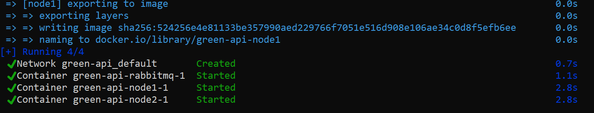
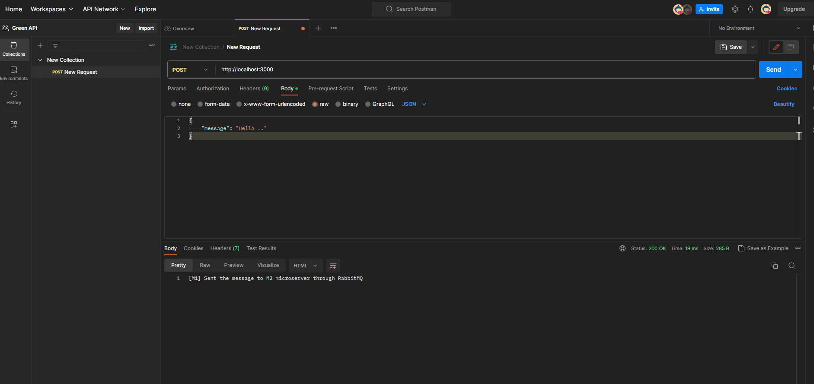

## How to run this project


To run this project, you need docker insralled in your device.
Doker is a tool that help to keep any project in its environment enywhere.

if you do not have doker in your device you can follow these guides based on your device OS:

- [Linux Docker installing guide](https://docs.docker.com/engine/install/ubuntu/)
- [Windows Docker installing guide](https://docs.docker.com/desktop/install/windows-install/)

So after succesfully installing docker to your machine, now you will clone this project to your machine as following:
```bash
$ git clone  https://github.com/AbdulxaqDev/green-api.git
```


And, you just run following command in termial (make sure you in correct directory, which is you cloned project):

```bash
$ docker compose up -d
```

Then, your terminal print some fancy stuff like following



Amazing, we have done setup, now turn is to try running aplication.


First you should understand the logic of this project, the login is as following


As you can see we need to do HTTP request and the project does same work. To send HTTP request you need [Postman](https://www.postman.com/)

You can any send request from Postman's web version as following to:
```
http://localhost:3000
```


So, with HTTP, we need to send post request with following payload:

```json
{
    "message": "Hello ..."
}
```
So you can send any kind of text. But, the dots have special meaning for this application. 

For every dot, the application is got poused for one second on M2 microserver.

If you send 
```json
{
    "message": "Hello ..."
}
```
string with HTTP post request,
M1 microserver sends it to M2 microserver through RabbitMQ (AMQP). Then M2 converts message to something like this:
```json
{
    "message": "Hello ###"
}
```
And, the M2 is paused for a second for each dot. This is just a smilation of processing.

It can image processing or pdf, any kind processing.

For the full explanation, watch this **[video](link)**
