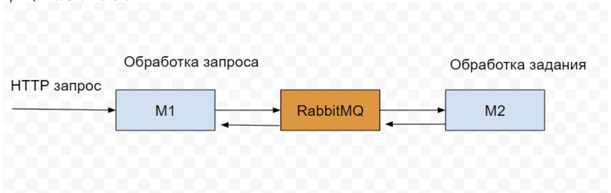

## Тестовое задание на должность "Разработчик NodeJS"

В рамках выполнения тестового задания требуется разработать механизм асинхронной обработки
HTTP запросов и опубликовать исходники проекта на Github для дальнейшего анализа и проверки.
Время на выполнения задания: 3 дня.

Требования:
1. Требуется разработать механизм асинхронной обработки HTTP запросов
2. Требуется использовать стек NodeJS, RabbitMQ
3. Требуется оформить в виде репозитория на Github
4. Требуется приложить инструкцию по локальному развертыванию проекта
5. Требуется реализовать логирование для целей отладки и мониторинга
6. Требуется разработать микросервис М1 для обработки входящих HTTP запросов
7. Требуется разработать микросервис М2 для обработки заданий из RabbitMQ

Алгоритм работы: 
• Получаем HTTP запрос на уровне микросервиса М1. 
• Транслируем HTTP запрос в очередь RabbitMQ. Запрос трансформируется в задание. 
• Обрабатываем задание микросервисом М2 из очереди RabbitMQ. 
• Помещаем результат обработки задания в RabbitMQ. 
• Возвращаем результат HTTP запроса как результат выполнения задания из RabbitMQ. 
Принципиальная схема: 

Результат:
Результат выполнения задания просьба отправить на адрес support@green-api.com в формате:
Тема: Тестовое задание на должность - Разработчик NodeJS
1. Ваше резюме - приложить файл pdf
2. Ссылка на репозиторий github
3. Ссылка на профиль в Телеграм для быстрой связи
4. Ссылка на скриншоты/видео-презентацию (при наличии)

ООО «ГРИН-АПИ» (с) 2023г.
 

 
 
 

## Test task for the position "NodeJS Developer"

As part of the test task, it is required to develop a mechanism for asynchronous processing
HTTP requests and publish project sources on Github for further analysis and verification.
Time to complete the task: 3 days.

Requirements:
1. It is required to develop a mechanism for asynchronous processing of HTTP requests
2. Required to use NodeJS stack, RabbitMQ
3. Required to issue as a repository on Github
4. You need to attach instructions for local deployment of the project
5. It is required to implement logging for debugging and monitoring purposes
6. It is required to develop an M1 microservice for processing incoming HTTP requests
7. It is required to develop an M2 microservice for processing jobs from RabbitMQ

Work algorithm: 
• We receive an HTTP request at the M1 microservice level. 
• Broadcast the HTTP request to the RabbitMQ queue. The request is transformed into a task. 
• We process the task with the M2 microservice from the RabbitMQ queue. 
• We put the result of processing the job in RabbitMQ. 
• We return the result of the HTTP request as the result of the execution of the job from RabbitMQ.
Schematic diagram: 

Result:
Please send the result of the task to support@green-api.com in the following format:
Topic: Job Test - NodeJS Developer
1. Your resume - attach a pdf file
2. Link to the github repository
3. Link to the profile in Telegram for quick communication
4. Link to screenshots / video presentation (if available)

JSC «ГРИН-АПИ» (с) 2023y.